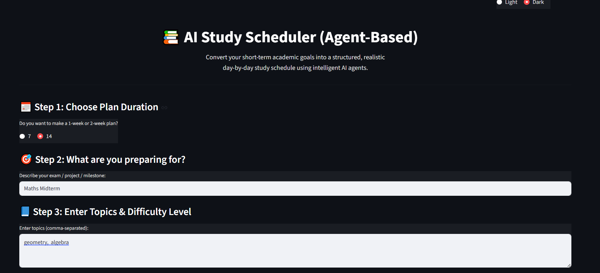
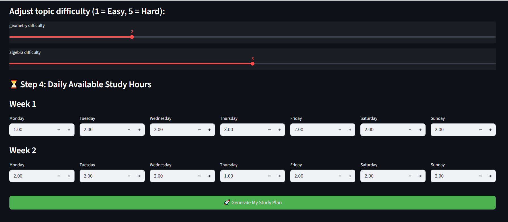
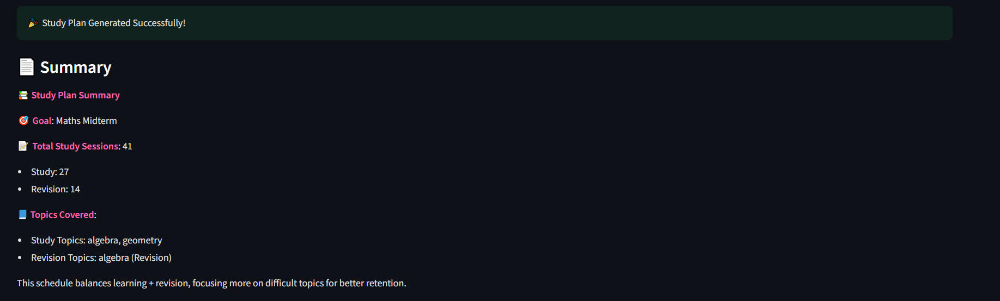
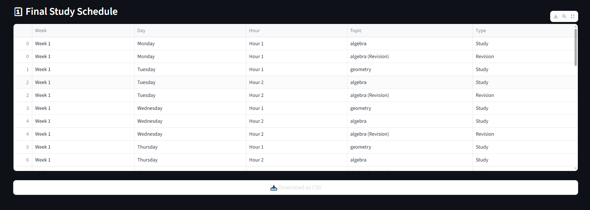

# 📚 AI Study Scheduler (Agent-Based)

An intelligent study-planning tool built using Python, Streamlit, and agent-based logic.
It converts your academic goals, topics, difficulty levels, and available study hours into a personalized day-by-day study plan with revision sessions based on difficulty.

# 🚀 Features

🧠 Planner Agent — arranges topics based on difficulty

🗓 Calendar Agent — schedules topics into available time slots

🔁 Revision Agent — adds extra revision sessions for difficult topics

📝 Summary Agent — generates a clean summary of the study plan

📅 Supports 1-week and 2-week plans

⏰ Accepts flexible daily time inputs (e.g., 2-4pm, 8-9pm)

📥 Export final schedule as CSV

🎨 Light & Dark mode theme for UI

# 🛠️ Installation

Make sure you have Python 3.10+ installed.

### 1️⃣ Clone the repository

git clone https://github.com/yourusername/ai-study-scheduler.git

cd ai-study-scheduler

### 2️⃣ Create and activate virtual environment

python -m venv venv

venv\Scripts\activate

### 3️⃣ Install required dependencies

streamlit

pandas

python-dotenv

#### bash

pip install -r requirements.txt

### ▶️ Running the App 

streamlit run main.py

# 📖 How to Use

### Step 1 — Choose Plan Duration

Select a 7-day or 14-day study schedule.

### Step 2 — Enter Goal & Topics

Add the goal (exam, project, etc.) and list topics (comma-separated).

### Step 3 — Select Difficulty

For every topic, choose difficulty (1–5).

Hard topics (4–5) get automatic revision sessions.

### Step 4 — Add Time Availability

Select daily available hours.

### Generate Plan

Click "Generate My Study Plan".

The agents collaborate to produce:

A final schedule

Study + revision session breakdown

A summary

A downloadable CSV

# 🧰 Tech Stack

### Streamlit

– Used to build an interactive and user-friendly web interface

### Python

– Handles the core logic and main functionalities of the application

### Pandas 

– Used for generating and manipulating schedule data in a tabular format

# 🧪 Example Input & Output

## 📝 Example Input

## 📝 Example Output

